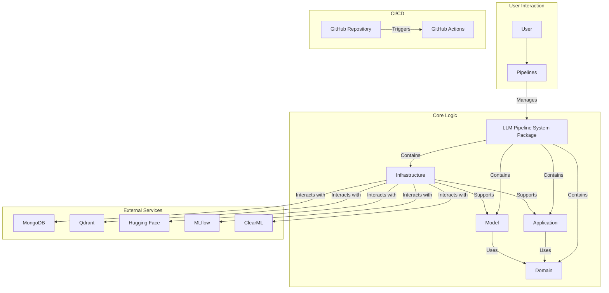

**Explanation:**

*   **User Interaction:** The user interacts with the system by running the defined pipelines.
*   **Core Logic:** The `llm_pipeline_system` package contains the core logic of the application, which is organized according to Domain-Driven Design principles:
    *   `Domain`: Defines the core business entities and data structures.
    *   `Application`: Contains the business logic, including data crawling and the RAG implementation.
    *   `Model`: Handles LLM training and inference.
    *   `Infrastructure`: Manages integrations with external services.
*   **External Services:** The system relies on several external services for its functionality:
    *   `MongoDB`: As the NoSQL database.
    *   `Qdrant`: As the vector database for the RAG system.
    *   `Hugging Face`: As the model registry.
    *   `MLflow`: For experiment tracking.
    *   `ClearML`: For experiment automation and orchestration.
*   **CI/CD:** The project uses GitHub Actions for continuous integration and deployment.
