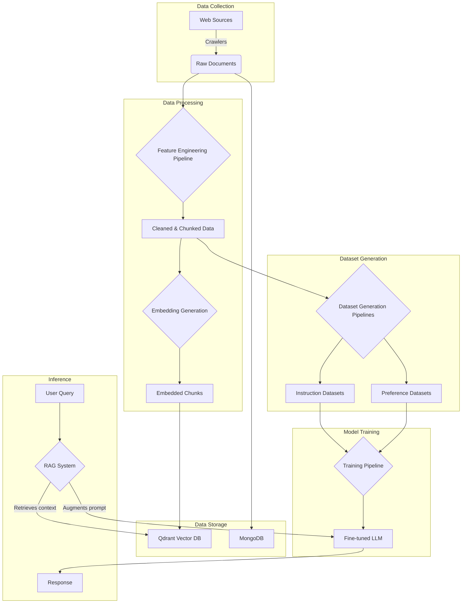

**Explanation:**

1.  **Data Collection:** The process begins with crawlers collecting data from various web sources, which is stored as raw documents in MongoDB.
2.  **Data Processing:** The raw documents are then processed by the feature engineering pipeline. This involves cleaning the data, chunking it into smaller pieces, and generating embeddings for each chunk.
3.  **Data Storage:** The embedded chunks are stored in the Qdrant vector database for efficient similarity search, while the raw documents are stored in MongoDB.
4.  **Dataset Generation:** The cleaned and chunked data is used to generate instruction and preference datasets, which are used to fine-tune the LLM.
5.  **Model Training:** The training pipeline uses the generated datasets to fine-tune a pre-trained LLM from Hugging Face locally.
6.  **Inference:** During inference, a user query is sent to the RAG system. The RAG system retrieves relevant context from the Qdrant vector database, augments the user's prompt with this context, and sends it to the fine-tuned LLM to generate a response.
