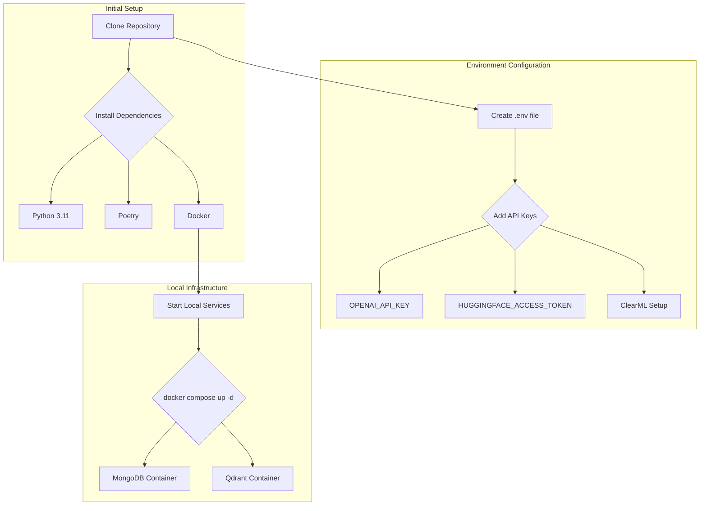

**Explanation:**

This chart outlines the steps to get the project running locally.

1.  **Initial Setup:**
    *   **Clone Repository:** First, you need to clone the project's Git repository to your local machine.
    *   **Install Dependencies:** You need to have Python 3.11, Poetry for package management, and Docker for running local services.

2.  **Environment Configuration:**
    *   **Create .env file:** Copy the `.env.example` file to a new file named `.env`.
    *   **Add API Keys:** You need to add your API keys for OpenAI and Hugging Face to the `.env` file. ClearML configuration is done separately via `clearml-init`.

3.  **Local Infrastructure:**
    *   **Start Local Services:** Run the `docker compose up -d` command to start the local development environment.
    *   This command will start a MongoDB container for the NoSQL database and a Qdrant container for the vector database.
