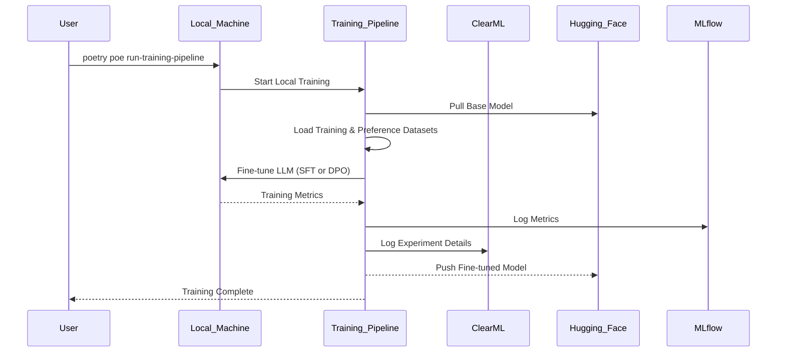

**Explanation:**

1.  **Initiation:** The user initiates the training process by running the `poetry poe run-training-pipeline` command on their local machine.
2.  **Pipeline Start:** The command triggers the training pipeline.
3.  **Model Loading:** The pipeline pulls the base LLM from the Hugging Face model registry.
4.  **Data Loading:** It loads the instruction and preference datasets that were generated in the data processing stage.
5.  **Local Fine-Tuning:** The fine-tuning process for the LLM (either Supervised Fine-Tuning (SFT) or Direct Preference Optimization (DPO), depending on the configuration) is executed directly on the local machine.
6.  **Metrics Logging:** During and after training, training metrics are logged to MLflow for experiment tracking. The entire experiment, including code, dependencies, and logs, is also captured by ClearML.
7.  **Model Pushing:** Once training is complete, the fine-tuned model can be pushed to the Hugging Face model registry.
8.  **Completion:** The user is notified that the training process is complete.
